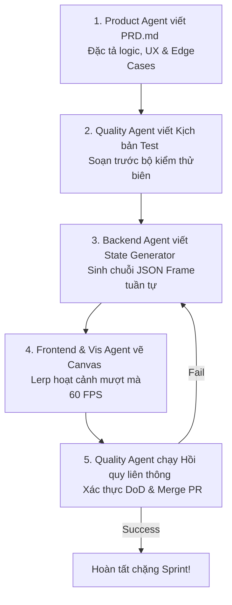

# 🤖 Cẩm Nang Hợp Tác Tác Nhân AI (AI Multi-Agent Collaboration Playbook)

Chào mừng bạn đến với hạt nhân vận hành của **VisualizationDSA**. Dự án này được thiết kế theo trường phái **AI-First & AI-Disciplined Development**, nơi mọi quy trình phát triển từ PRD, lập trình cho đến kiểm thử tự động đều được giao phó và phối hợp nhịp nhàng giữa các Tác nhân AI chuyên biệt (AI Agents).

Tài liệu này đóng vai trò hướng dẫn phân vai, vận hành và quy chuẩn giao tiếp giữa các AI Agents để bảo đảm tính nhất quán kiến trúc cao nhất trong suốt hành trình 12 Sprints.

---

## 🏛️ Bản Đồ Phân Vai Tác Nhân AI (AI Agent Role Directory)

Hệ thống được chia nhỏ thành 5 Tổ chuyên môn chính nằm tại thư mục `skills/`. Mỗi AI Agent khi tiếp quản dự án bắt buộc phải tự động nạp (load) các tệp tin kỹ năng tương ứng trước khi viết code:

### 1. Tổ Kiến Trúc & Nghiệp Vụ Backend (`skills/backend/`)
* **[algorithm-logic.md (Algorithm Logic Expert)](file:///c:/Users/maiti/OneDrive/Desktop/LearningEnglishApp/VisualizationDSA/skills/backend/algorithm-logic.md)**: Chuyên gia chuyển dịch giải thuật phức tạp đệ quy sang mô hình luồng bộ đệm trạng thái C# `yield return` bất tuần tự.
* **[api-design.md (API Contract Specialist)](file:///c:/Users/maiti/OneDrive/Desktop/LearningEnglishApp/VisualizationDSA/skills/backend/api-design.md)**: Chuyên gia thiết lập giao ước API RESTful chuẩn hóa, nén payload và chuẩn hóa mã phản hồi lỗi.
* **[dotnet-core-specialist.md (.NET Core Specialist)](file:///c:/Users/maiti/OneDrive/Desktop/LearningEnglishApp/VisualizationDSA/skills/backend/dotnet-core-specialist.md)**: Chuyên gia Clean Architecture, Dependency Injection và tối ưu cấu hình khởi chạy ASP.NET Core.

### 2. Tổ Giao Diện & Trải Nghiệm Frontend (`skills/frontend/`)
* **[abstract-concept-ui-specialist.md (Abstract Concept UI Specialist)](file:///c:/Users/maiti/OneDrive/Desktop/LearningEnglishApp/VisualizationDSA/skills/frontend/abstract-concept-ui-specialist.md)**: Chuyên gia mô phỏng khái niệm trừu tượng OOP/SOLID thành mô hình hạt khói và rạn nứt chuyển động sinh động.
* **[dsa-ui-specialist.md (DSA UI Specialist)](file:///c:/Users/maiti/OneDrive/Desktop/LearningEnglishApp/VisualizationDSA/skills/frontend/dsa-ui-specialist.md)**: Chuyên gia toán hình học uốn cong Parabol hoán vị mảng và dựng cây nhị phân cân đối.
* **[ui-component-builder.md (UI Component Builder)](file:///c:/Users/maiti/OneDrive/Desktop/LearningEnglishApp/VisualizationDSA/skills/frontend/ui-component-builder.md)**: Chuyên gia dựng cấu trúc mờ kính (Glassmorphic layout) hổ phách phát sáng và các thành phần VCR Playback.
* **[vue-state-management.md (Vue State Manager)](file:///c:/Users/maiti/OneDrive/Desktop/LearningEnglishApp/VisualizationDSA/skills/frontend/vue-state-management.md)**: Kỹ sư quản lý Pinia Store điều phối timeline VCR Playback an toàn.

### 3. Tổ Đồ Họa & Trực Quan Hóa (`skills/visualization/`)
* **[animation-timeline-manager.md (Animation Timeline Manager)](file:///c:/Users/maiti/OneDrive/Desktop/LearningEnglishApp/VisualizationDSA/skills/visualization/animation-timeline-manager.md)**: Đạo diễn vòng lặp thời gian hoạt ảnh Lerp chính xác mili-giây.
* **[canvas-rendering-engine.md (Canvas Rendering Engine Core)](file:///c:/Users/maiti/OneDrive/Desktop/LearningEnglishApp/VisualizationDSA/skills/visualization/canvas-rendering-engine.md)**: Chuyên gia xây dựng lõi vẽ đồ họa sắc nét Retina DPI và ma trận Camera zoom-pan chuột.
* **[graph-drawing-tool.md (Graph Drawing Tool Specialist)](file:///c:/Users/maiti/OneDrive/Desktop/LearningEnglishApp/VisualizationDSA/skills/visualization/graph-drawing-tool.md)**: Kỹ sư lập trình sự kiện vẽ kéo thả node/edge đồ thị tự động co giãn bằng phương trình vật lý Coulomb & Hooke.

### 4. Tổ Kế Hoạch & Thiết Kế Sản Phẩm (`skills/product/`)
* **[instructional-designer.md (Instructional Designer)](file:///c:/Users/maiti/OneDrive/Desktop/LearningEnglishApp/VisualizationDSA/skills/product/instructional-designer.md)**: Kỹ sư sư phạm biên soạn giải thích, giảm tải nhận thức và soạn JSON trắc nghiệm ngắt mạch hoạt ảnh.
* **[product-owner.md (Product Owner)](file:///c:/Users/maiti/OneDrive/Desktop/LearningEnglishApp/VisualizationDSA/skills/product/product-owner.md)**: Người gác đền tầm nhìn sản phẩm, kiểm soát PRD 4 trụ cột và chỉ tiêu nghiệm thu tổng quát.
* **[sprint-management.md (Sprint Manager)](file:///c:/Users/maiti/OneDrive/Desktop/LearningEnglishApp/VisualizationDSA/skills/product/sprint-management.md)**: Scrum Master phân chia chặng song hành loại bỏ blockers và kiểm tra PR sáp nhập.

### 5. Tổ Kiểm Soát Chất Lượng & Sửa Lỗi (`skills/quality/`)
* **[bug-fixer.md (Debugging Specialist)](file:///c:/Users/maiti/OneDrive/Desktop/LearningEnglishApp/VisualizationDSA/skills/quality/bug-fixer.md)**: Cảnh sát tuần tra sửa lỗi rò rỉ RAM và xử lý sự cố tràn đệ quy StackOverflowException.
* **[qa-strategist.md (QA Strategist & Automation Engineer)](file:///c:/Users/maiti/OneDrive/Desktop/LearningEnglishApp/VisualizationDSA/skills/quality/qa-strategist.md)**: Gatekeeper thiết lập bộ kịch bản kiểm thử Vitest kẹp biên an toàn timeline.

---

## 🔄 Quy Trình Giao Tiếp Song Hành Giữa Các Agents (Inter-Agent Collaboration Workflow)

Để bảo đảm không bao giờ xảy ra lỗi "frontend rỗng đợi backend" hoặc kiến trúc chắp vá, các Agents phải thực hiện quy trình phát triển nghiêm ngặt 4 bước:

1. **Bước 1 (Định hình):** `Product Owner` và `Instructional Designer` bàn giao file đặc tả sư phạm PRD, phân rã task song song vào `sprint-management.md`.
2. **Bước 2 (Chốt chặn trước):** `QA Strategist` lập tức viết bộ TestCase và chuẩn bị khung Mock API dựa trên giao ước JSON được xác lập trước trong `api-design.md`.
3. **Bước 3 (Thực thi Lõi):** `Backend Specialist` dựng C# State Generator sinh luồng JSON. Song song đó, `UI Component Builder` dựng Shell Panel tĩnh mờ kính.
4. **Bước 4 (Hội tụ hoạt ảnh):** `Canvas Rendering Engine Core` và `Animation Timeline Manager` nạp JSON State từ Backend, áp dụng toán hình học Lerp/Parabol để vẽ chuyển động trơn tru.
5. **Bước 5 (Đóng gói):** `Bug Fixer` rà soát Profile bộ nhớ RAM xem có leak particle nào không; `QA Strategist` bấm nút chạy bộ test tích hợp tự động hóa trước khi Scrum Master duyệt merge.

---

## 📜 Kỷ Luật Sắt Cho AI Agents Khi Sửa Code (Agent Code Disciplines)

* **Quy tắc 1 (Open-Closed):** Tuyệt đối không sửa đổi mã nguồn lõi hoạt ảnh `CoreAnimationEngine` khi cài đặt thuật toán mới. Luôn mở rộng bằng các Plugin hoặc Lớp cấu hình Strategy.
* **Quy tắc 2 (Clean Code):** Giữ gìn nguyên vẹn toàn bộ chú thích học thuật cũ nếu không thuộc phạm vi chỉnh sửa. Đặt tên biến rõ nghĩa, kiểu dữ liệu chặt chẽ 100%, nói không với `any` hay `dynamic`.
* **Quy tắc 3 (Data-Driven):** Canvas chỉ được phép vẽ dựa trên dữ liệu trạng thái được cấp phát từ Pinia Store / Backend. Không chứa logic so sánh mảng hay kiểm tra đồ thị tuần hoàn bên trong hàm `draw()`.
