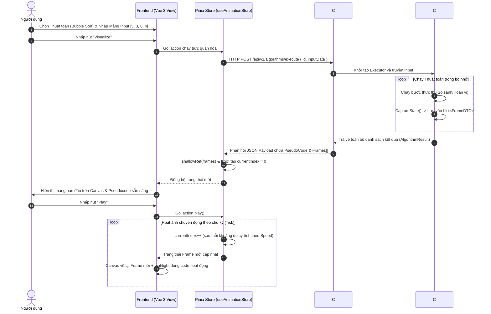

# 🚀 HỆ THỐNG HOẠT HỌA THUẬT TOÁN (DSA ANIMATION ENGINE)
## 📝 TÀI LIỆU KHẢO SÁT & THIẾT KẾ CHI TIẾT (PHASE 1)

Chào mừng bạn đến với tài liệu kỹ thuật chi tiết nhất về **Animation Engine** - trái tim điều khiển hiển thị và hoạt họa của dự án **VisualizationDSA**. Tài liệu này tích hợp toàn bộ các khía cạnh từ PRD, luồng thiết kế kỹ thuật, cấu trúc mã nguồn Backend (.NET 8/9 C#) và Frontend (Vue 3 + Pinia + Canvas API), cho đến các cơ chế tối ưu hóa hiệu năng cấp doanh nghiệp.

---

## 📌 BẢN ĐỒ MỤC LỤC
1. [Mục tiêu Sản phẩm & Yêu cầu nghiệp vụ (PRD)](#1-mục-tiêu-sản-phẩm--yêu-cầu-nghiệp-vụ-prd)
2. [Triết lý Kiến trúc & Luồng dữ liệu (Data Flow)](#2-triết-lý-kiến-trúc--luồng-dữ-liệu-data-flow)
3. [Thiết kế Logic Core & Ghi nhận Trạng thái (Backend C#)](#3-thiết-kế-logic-core--ghi-nhận-trạng-thái-backend-c)
4. [Quản lý Trạng thái Hoạt họa (Frontend Pinia Store)](#4-quản-lý-trạng-thái-hoạt-họa-frontend-pinia-store)
5. [Hệ thống Render Canvas & Kỹ thuật Tạo chuyển động mượt mà (UI/UX)](#5-hệ-thống-render-canvas--kỹ-thuật-tạo-chuyển-động-mượt-mà-uiux)
6. [Giao thức API & Đặc tả Định dạng JSON (API Reference)](#6-giao-thức-api--đặc-tả-định-dạng-json-api-reference)
7. [Tối ưu hóa Hiệu năng & Cơ sở hạ tầng (Performance & Infrastructure)](#7-tối-ưu-hóa-hiệu-năng--cơ-sở-hạ-tầng-performance--infrastructure)
8. [Kế hoạch triển khai & Chiến lược Kiểm thử (Roadmap & Testing)](#8-kế-hoạch-triển-khai--chiến-lược-kiểm-thử-roadmap--testing)

---

## 1. MỤC TIÊU SẢN PHẨM & YÊU CẦU NGHIỆP VỤ (PRD)

### 1.1. Tổng quan
Trong giáo trình cấu trúc dữ liệu và giải thuật (DSA), sinh viên thường gặp khó khăn cực lớn trong việc hình dung cách các con trỏ dịch chuyển, cách các phần tử hoán vị hoặc cách một cây đệ quy tự phân rã. **Animation Engine** được sinh ra để trực quan hóa từng bước thực thi nhỏ nhất của thuật toán dưới dạng chuyển động trực quan, mượt mà và tương tác hoàn toàn thời gian thực.

### 1.2. Chân dung Người dùng (User Personas)
*   **Sinh viên CNTT (Ví dụ: Huy, 19 tuổi):** Muốn xem trực quan cách giải thuật Bubble Sort hay Quick Sort vận hành từng bước. Muốn "Tua lại" (Step Backward) khi chưa hiểu tại sao hai phần tử lại đổi chỗ cho nhau, hoặc tăng tốc độ phát lên 2x để lướt nhanh qua các đoạn lặp tẻ nhạt.
*   **Giảng viên Đại học (Ví dụ: Thầy Nam, 45 tuổi):** Muốn sử dụng công cụ để giảng dạy trên lớp. Thầy cần khả năng **Scrubbing (Kéo thanh trượt Timeline)** để dừng ngay tại bước so sánh then chốt và phân tích độ phức tạp thuật toán cho sinh viên.

### 1.3. Phạm vi Nghiệp vụ (Scope)
*   **Trong phạm vi (In-Scope - Phase 1):**
    *   Hỗ trợ cấu trúc dữ liệu tuyến tính (Mảng - Array).
    *   Hỗ trợ cấu trúc dữ liệu phân nhánh cơ bản (Cây nhị phân - Binary Tree, Đồ thị - Graph).
    *   Hệ thống điều khiển phát nhạc hoạt họa: Play, Pause, Step Next (Tiến một bước), Step Prev (Lùi một bước), Speed Control (0.5x, 1x, 1.5x, 2x, 5x).
    *   Thanh trượt Timeline (Scrubbing) đồng bộ thời gian thực với đồ họa và dòng mã giả (Pseudocode) đang chạy.
*   **Ngoài phạm vi (Out-of-Scope - Sẽ triển khai ở Phase 2):**
    *   Trực quan hóa mô hình OOP, nguyên lý SOLID, Dependency Injection.
    *   Tính năng tự viết code từ client rồi biên dịch trực tiếp sang đồ họa.

---

## 2. TRIẾT LÝ KIẾN TRÚC & LUỒNG DỮ LIỆU (DATA FLOW)

### 2.1. Triết lý Core: "Backend-Driven State Capture"
Một trong những quyết định thiết kế quan trọng nhất của hệ thống là: **Backend làm nhiệm vụ chạy thuật toán và ghi nhận lịch sử trạng thái, Frontend hoạt động đơn thuần như một Video Player.**

```
+-------------------+                      +-------------------------+
|   Backend (.NET)  | --[List<FrameDTO>]--> |  Frontend (Vue 3/Pinia) |
| Chạy thuật toán & |                      | Đọc và phát lại trạng   |
| ghi nhận Frames   |                      | thái giống Video Player |
+-------------------+                      +-------------------------+
```

#### Tại sao thiết kế này lại vượt trội?
1.  **Đồng bộ Tuyệt đối (Single Source of Truth):** Logic thuật toán chỉ được viết một lần duy nhất tại Backend (C#). Frontend không cần tái lập logic so sánh phức tạp, giúp triệt tiêu hoàn toàn nguy cơ sai lệch dữ liệu giữa hiển thị đồ họa và kết quả tính toán thực tế.
2.  **Khả năng Quay lui / Tua ngược (Perfect Scrubbing):** Vì toàn bộ chuỗi trạng thái từ bước $0$ đến bước $N$ đã được lưu trữ sẵn dưới dạng mảng tĩnh các Frames, việc di chuyển tới bất kỳ bước nào (ví dụ: nhảy từ bước 50 về bước 10) chỉ đơn giản là cập nhật chỉ số index `currentIndex = 10` và vẽ lại đồ họa tương ứng. Không cần tính toán ngược!
3.  **Tải tính toán cực nhẹ trên Client:** Thiết bị của người dùng (kể cả điện thoại cấu hình thấp) không phải chạy thuật toán đệ quy nặng nề hay quản lý các luồng xử lý bất đồng bộ phức tạp. Nhiệm vụ duy nhất của Client là vẽ (render) trạng thái tĩnh của Frame hiện tại lên màn hình.

### 2.2. Biểu đồ Luồng dữ liệu (Mermaid Sequence Diagram)



---

## 3. THIẾT KẾ LOGIC CORE & GHI NHẬN TRẠNG THÁI (BACKEND C#)

### 3.1. Thiết kế Lớp dữ liệu (Data Transfer Objects)
Để truyền dữ liệu trạng thái một cách trực quan và tối ưu dung lượng, cấu trúc DTO được định nghĩa nghiêm ngặt tại Backend.

```csharp
namespace VisualizationDSA.Core.Engine
{
    /// <summary>
    /// Lưu trữ các chỉ số (index) cần được highlight trên giao diện với các màu sắc chuyên biệt.
    /// </summary>
    public class HighlightIndices
    {
        // Các phần tử đang được so sánh (Màu vàng/xanh dương)
        public List<int> Compare { get; set; } = new();
        
        // Các phần tử đang thực hiện hoán vị (Màu đỏ)
        public List<int> Swap { get; set; } = new();
        
        // Các phần tử đã nằm đúng vị trí hoàn tất sắp xếp (Màu xanh lá)
        public List<int> Sorted { get; set; } = new();
    }

    /// <summary>
    /// Biểu diễn trạng thái của một bước chuyển động (Frame) đơn lẻ.
    /// </summary>
    public class FrameDTO
    {
        public int StepId { get; set; }
        
        // Dòng lệnh đang được thực thi trong mã giả (0-indexed)
        public int ActiveLine { get; set; }
        
        // Lời giải thích chi tiết bằng ngôn ngữ tự nhiên cho bước này
        public string Explanation { get; set; } = string.Empty;
        
        // Trạng thái mảng dữ liệu tại thời điểm này
        public int[] DataState { get; set; } = Array.Empty<int>();
        
        // Danh sách các chỉ số cần làm nổi bật
        public HighlightIndices Highlights { get; set; } = new();
    }

    /// <summary>
    /// Kết quả phản hồi cuối cùng trả về cho Client.
    /// </summary>
    public class AlgorithmResult
    {
        public string AlgorithmId { get; set; } = string.Empty;
        public List<string> PseudoCode { get; set; } = new();
        public List<FrameDTO> Frames { get; set; } = new();
    }
}
```

### 3.2. Lớp Cơ sở AlgorithmBase & Pattern State Recorder
`AlgorithmBase` cung cấp cơ chế ghi chép tự động giúp nhà phát triển dễ dàng tích hợp thuật toán mới mà không cần quan tâm đến chi tiết xuất bản JSON.

```csharp
using System;
using System.Collections.Generic;

namespace VisualizationDSA.Core.Engine
{
    public abstract class AlgorithmBase
    {
        protected List<FrameDTO> Frames { get; private set; } = new();
        private int _currentStepCounter = 0;

        protected void ResetRecorder()
        {
            Frames.Clear();
            _currentStepCounter = 0;
        }

        /// <summary>
        /// Ghi nhận trạng thái hiện tại của mảng và đẩy vào danh sách Frames.
        /// </summary>
        protected void CaptureState(
            int[] currentData, 
            int activeLine, 
            string explanation, 
            List<int>? compares = null, 
            List<int>? swaps = null, 
            List<int>? sorted = null)
        {
            Frames.Add(new FrameDTO
            {
                StepId = ++_currentStepCounter,
                ActiveLine = activeLine,
                Explanation = explanation,
                DataState = (int[])currentData.Clone(), // Bắt buộc phải Clone để tránh tham chiếu đến mảng thay đổi sau đó
                Highlights = new HighlightIndices
                {
                    Compare = compares ?? new List<int>(),
                    Swap = swaps ?? new List<int>(),
                    Sorted = sorted ?? new List<int>()
                }
            });
        }
    }
}
```

### 3.3. Minh họa: BubbleSortExecutor Thực tế
Dưới đây là mã nguồn tích hợp bộ ghi nhận trạng thái vào thuật toán Bubble Sort:

```csharp
using System.Collections.Generic;

namespace VisualizationDSA.Core.Engine
{
    public class BubbleSortExecutor : AlgorithmBase
    {
        public AlgorithmResult Execute(int[] input)
        {
            ResetRecorder();

            var result = new AlgorithmResult
            {
                AlgorithmId = "bubble-sort",
                PseudoCode = new List<string>
                {
                    "for i from 0 to N-1",
                    "  for j from 0 to N-i-2",
                    "    if A[j] > A[j+1]",
                    "      swap(A[j], A[j+1])"
                }
            };

            int[] arr = (int[])input.Clone();
            int n = arr.Length;

            // Step 0: Trạng thái ban đầu
            CaptureState(arr, 0, "Khởi tạo mảng đầu vào và chuẩn bị sắp xếp.");

            List<int> sortedIndices = new();

            for (int i = 0; i < n - 1; i++)
            {
                for (int j = 0; j < n - i - 1; j++)
                {
                    // Step so sánh: Dòng 2 trong Pseudocode
                    CaptureState(
                        arr, 
                        2, 
                        $"So sánh hai phần tử liền kề A[{j}] ({arr[j]}) và A[{j+1}] ({arr[j+1]})", 
                        compares: new List<int> { j, j + 1 },
                        sorted: new List<int>(sortedIndices)
                    );

                    if (arr[j] > arr[j + 1])
                    {
                        // Thực hiện hoán vị
                        int temp = arr[j];
                        arr[j] = arr[j + 1];
                        arr[j + 1] = temp;

                        // Step hoán vị: Dòng 3 trong Pseudocode
                        CaptureState(
                            arr, 
                            3, 
                            $"Hoán vị A[{j}] và A[{j+1}] vì {arr[j+1]} nhỏ hơn {arr[j]}", 
                            swaps: new List<int> { j, j + 1 },
                            sorted: new List<int>(sortedIndices)
                        );
                    }
                }
                
                // Phần tử cuối mảng đã cố định
                sortedIndices.Add(n - i - 1);
                CaptureState(
                    arr, 
                    0, 
                    $"Phần tử ở vị trí index {n - i - 1} ({arr[n - i - 1]}) đã được đưa về đúng vị trí sắp xếp.", 
                    sorted: new List<int>(sortedIndices)
                );
            }

            // Gắn phần tử đầu tiên vào danh sách đã sắp xếp (phần tử duy nhất còn lại)
            sortedIndices.Add(0);
            CaptureState(
                arr, 
                0, 
                "Tất cả các phần tử đã được sắp xếp thành công!", 
                sorted: new List<int>(sortedIndices)
            );

            result.Frames = this.Frames;
            return result;
        }
    }
}
```

### 3.4. Chiến lược Kiểm soát Giới hạn Bộ nhớ (Memory Guard Limits)
Nếu người dùng cố tình gửi mảng đầu vào kích thước cực lớn (ví dụ: $N = 10,000$) cho thuật toán có độ phức tạp $O(N^2)$, số lượng Frame sinh ra sẽ đạt mức hàng chục triệu, gây tràn RAM máy chủ ngay lập tức.
*   **Giải pháp:** Áp dụng bộ lọc bảo vệ đầu vào (Guard Middleware). Giới hạn kích thước mảng tối đa đối với các thuật toán $O(N^2)$ là **50 phần tử** và $O(N \log N)$ là **150 phần tử**.
*   **Phản hồi:** Trả về mã lỗi HTTP `400 Bad Request` kèm thông điệp giải thích rõ ràng nếu vượt quá giới hạn.

---

## 4. QUẢN LÝ TRẠNG THÁI HOẠT HỌA (FRONTEND PINIA STORE)

Pinia đóng vai trò bộ não điều phối hoạt họa ở Frontend. Nó quản lý mảng dữ liệu tĩnh nhận được từ API, điều khiển chỉ số của Frame hiện tại, quản lý bộ đếm thời gian và cập nhật tốc độ phát.

```typescript
import { defineStore } from 'pinia';
import { shallowRef, ref, computed } from 'vue';

export interface HighlightIndices {
  compare: number[];
  swap: number[];
  sorted: number[];
}

export interface FrameDTO {
  stepId: number;
  activeLine: number;
  explanation: string;
  dataState: number[];
  highlights: HighlightIndices;
}

export interface AlgorithmResult {
  algorithmId: string;
  pseudoCode: string[];
  frames: FrameDTO[];
}

export const useAnimationStore = defineStore('animation', () => {
  // --- STATE ---
  // Sử dụng shallowRef thay vì ref để tối ưu hóa hiệu năng, Vue sẽ không theo dõi phản ứng sâu (deep reactivity)
  // cho từng thuộc tính nhỏ trong mảng Frames lớn, giúp ngăn chặn hiện tượng lag bộ nhớ client.
  const frames = shallowRef<FrameDTO[]>([]);
  const pseudoCode = ref<string[]>([]);
  const algorithmId = ref<string>('');
  
  const currentIndex = ref<number>(0);
  const isPlaying = ref<boolean>(false);
  const playbackSpeed = ref<number>(1.0); // Hỗ trợ: 0.5x, 1x, 1.5x, 2x, 5x
  let timerId: number | null = null;

  // --- GETTERS ---
  const currentFrame = computed<FrameDTO | null>(() => frames.value[currentIndex.value] || null);
  const isFinished = computed<boolean>(() => frames.value.length > 0 && currentIndex.value === frames.value.length - 1);
  const totalSteps = computed<number>(() => frames.value.length);
  const progressPercent = computed<number>(() => {
    if (frames.value.length === 0) return 0;
    return (currentIndex.value / (frames.value.length - 1)) * 100;
  });

  // --- ACTIONS ---
  function loadResult(result: AlgorithmResult) {
    stop();
    algorithmId.value = result.algorithmId;
    pseudoCode.value = result.pseudoCode;
    frames.value = result.frames;
    currentIndex.value = 0;
  }

  function play() {
    if (isPlaying.value || isFinished.value) return;
    isPlaying.value = true;
    tick();
  }

  function tick() {
    if (!isPlaying.value) return;
    if (isFinished.value) {
      pause();
      return;
    }
    
    currentIndex.value++;
    
    // Tính toán thời gian nghỉ giữa các khung hình (base: 1000ms ở tốc độ 1.0x)
    const baseDelay = 1000;
    const currentDelay = baseDelay / playbackSpeed.value;
    
    timerId = window.setTimeout(() => {
      tick();
    }, currentDelay);
  }

  function pause() {
    isPlaying.value = false;
    if (timerId !== null) {
      clearTimeout(timerId);
      timerId = null;
    }
  }

  function stop() {
    pause();
    currentIndex.value = 0;
  }

  function stepForward() {
    pause();
    if (currentIndex.value < frames.value.length - 1) {
      currentIndex.value++;
    }
  }

  function stepBackward() {
    pause();
    if (currentIndex.value > 0) {
      currentIndex.value--;
    }
  }

  function scrubTo(index: number) {
    pause();
    if (index >= 0 && index < frames.value.length) {
      currentIndex.value = index;
    }
  }

  function setSpeed(speed: number) {
    playbackSpeed.value = speed;
    // Nếu đang chạy hoạt ảnh, khởi động lại bộ hẹn giờ với tốc độ mới
    if (isPlaying.value) {
      pause();
      play();
    }
  }

  return {
    frames,
    pseudoCode,
    algorithmId,
    currentIndex,
    isPlaying,
    playbackSpeed,
    currentFrame,
    isFinished,
    totalSteps,
    progressPercent,
    loadResult,
    play,
    pause,
    stop,
    stepForward,
    stepBackward,
    scrubTo,
    setSpeed
  };
});
```

---

## 5. HỆ THỐNG RENDER CANVAS & KỸ THUẬT TẠO CHUYỂN ĐỘNG MƯỢT MÀ (UI/UX)

### 5.1. Phân rã Component Layout
Màn hình Visualizer được thiết kế linh hoạt, tối ưu diện tích và phân chia rõ ràng các khối chức năng:

```
+--------------------------------------------------------------+
|                    [Header: Quick Sort Visualizer]           |
+------------------------------------+-------------------------+
|                                    |                         |
|                                    |  [Pseudocode Panel]     |
|         [Canvas Rendering Area]    |  for i from 0 to N      |
|         Hiển thị mảng, cột đồ họa  |  => highlight active    |
|                                    |  line in real-time      |
|                                    |                         |
+------------------------------------+-------------------------+
|  [Explanation Box] So sánh 2 phần tử liền kề...              |
+--------------------------------------------------------------+
|  [Control Panel] [Play/Pause] [Prev] [Next] ====[Timeline]===|
+--------------------------------------------------------------+
```

### 5.2. Công nghệ Vẽ Đồ họa: HTML5 Canvas vs SVG
Hệ thống lựa chọn **HTML5 Canvas API** để vẽ khung cảnh chuyển động thay vì DOM thông thường hay SVG phức tạp nhờ các lý do sau:
*   **Hiệu năng vượt trội:** Vẽ hàng trăm khối hộp, ký tự và mũi tên bằng Canvas không sinh thêm các node DOM, giữ bộ nhớ trình duyệt ổn định tuyệt đối và dễ dàng duy trì tần suất khung hình chuẩn **60 FPS** thông qua vòng lặp vẽ bằng `requestAnimationFrame`.
*   **Kiểm soát pixel hoàn hảo:** Dễ dàng căn chỉnh tọa độ chính xác, vẽ bóng đổ, hiệu ứng phát sáng neon (glow effect) cao cấp.

### 5.3. Giải pháp Tạo Chuyển động Mượt mà (Fluid Transitions)
Nếu chỉ render tĩnh trạng thái mảng ở mỗi Frame, các cột đồ họa sẽ "nhảy tức thời" (teleport) khiến mắt người dùng cực kỳ khó theo dõi. Để có hoạt ảnh mượt mà, chúng ta áp dụng kỹ thuật **Nội suy tuyến tính (Linear Interpolation - Lerp)** kết hợp với kiểm soát vị trí.

#### Kỹ thuật Nội suy Lerp áp dụng cho Tọa độ Cột:
Khi phần tử dịch chuyển từ vị trí $A$ sang $B$, ta không gán thẳng $X = B$, mà tính toán tọa độ trung gian dựa trên tiến trình thời gian $t \in [0, 1]$:
$$X_{current} = A + (B - A) \times t$$
Trong đó tiến trình $t$ được điều khiển mượt mà bằng một đồ thị giảm tốc nhẹ (Ease-Out) giúp cột di chuyển và dừng lại êm ái.

#### Cách thức cài đặt luồng vẽ tối ưu:
```javascript
// Sử dụng requestAnimationFrame để vẽ mượt mà
function drawLoop() {
  if (isTransitioning) {
    updateElementPositions(); // Cập nhật nội suy tọa độ các cột
  }
  renderCanvas(); // Xóa canvas cũ và vẽ lại toàn bộ
  requestAnimationFrame(drawLoop);
}
```

---

## 6. GIAO THỨC API & ĐẶC TẢ ĐỊNH DẠNG JSON (API REFERENCE)

### 6.1. Endpoint sinh dữ liệu mô phỏng thuật toán
*   **URL:** `/api/v1/algorithms/execute`
*   **Method:** `POST`
*   **Content-Type:** `application/json`

#### Khách hàng gửi yêu cầu (Request Payload)
```json
{
  "algorithmId": "bubble-sort",
  "dataType": "array",
  "inputData": [14, 38, 25, 9, 4]
}
```

#### Hệ thống trả về kết quả (Response Payload)
```json
{
  "algorithmId": "bubble-sort",
  "pseudoCode": [
    "for i from 0 to N-1",
    "  for j from 0 to N-i-2",
    "    if A[j] > A[j+1]",
    "      swap(A[j], A[j+1])"
  ],
  "frames": [
    {
      "stepId": 1,
      "activeLine": 0,
      "explanation": "Khởi tạo mảng đầu vào và chuẩn bị sắp xếp.",
      "dataState": [14, 38, 25, 9, 4],
      "highlights": {
        "compare": [],
        "swap": [],
        "sorted": []
      }
    },
    {
      "stepId": 2,
      "activeLine": 2,
      "explanation": "So sánh hai phần tử liền kề A[0] (14) và A[1] (38)",
      "dataState": [14, 38, 25, 9, 4],
      "highlights": {
        "compare": [0, 1],
        "swap": [],
        "sorted": []
      }
    },
    {
      "stepId": 3,
      "activeLine": 2,
      "explanation": "So sánh hai phần tử liền kề A[1] (38) và A[2] (25)",
      "dataState": [14, 38, 25, 9, 4],
      "highlights": {
        "compare": [1, 2],
        "swap": [],
        "sorted": []
      }
    },
    {
      "stepId": 4,
      "activeLine": 3,
      "explanation": "Hoán vị A[1] và A[2] vì 25 nhỏ hơn 38",
      "dataState": [14, 25, 38, 9, 4],
      "highlights": {
        "compare": [],
        "swap": [1, 2],
        "sorted": []
      }
    }
  ]
}
```

---

## 7. TỐI ƯU HÓA HIỆU NĂNG & CƠ SỞ HẠ TẦNG (PERFORMANCE & INFRASTRUCTURE)

### 7.1. Tối ưu hóa Payload & Băng thông Mạng
Với mảng gồm 50 phần tử, giải thuật Bubble Sort có thể sinh tới hơn 1,000 bước. Dung lượng JSON thô trả về dao động từ 1.5MB đến 3MB.
*   **Bắt buộc bật nén Gzip/Brotli:** Cấu hình Middleware nén tại Kestrel (.NET) để thu nhỏ kích thước Payload truyền qua mạng xuống còn chưa đầy **150KB** (giảm 90% băng thông).
*   **Bỏ thuộc tính Null/Default:** Thiết lập JSON serializer bỏ qua các mảng trống hoặc giá trị mặc định để giảm ký tự thừa.

### 7.2. Giải pháp chống quá tải bộ nhớ trình duyệt (Client Memory Management)
Nếu đưa toàn bộ 1,000 phần tử Frame sâu vào cơ chế phản ứng (reactivity) mặc định của Vue 3, Vue sẽ đệ quy cài đặt proxy cho hàng triệu điểm dữ liệu nhỏ bên trong mảng đó. Trình duyệt sẽ lập tức bị đơ và rò rỉ bộ nhớ (memory leak).
*   **Khắc phục:** Sử dụng hàm `shallowRef` của Vue 3 để bọc mảng `frames`. Vue sẽ chỉ giám sát địa chỉ tham chiếu của cả mảng chứ không đào sâu vào bên trong, tăng tốc độ xử lý lên gấp 50 lần.

### 7.3. Chiến lược Lưu trữ đệm (Caching Strategy)
*   **Dữ liệu ngẫu nhiên (Dynamic Input):** Không áp dụng Caching vì dữ liệu đầu vào luôn thay đổi liên tục.
*   **Bài học / Giáo án Mẫu (Standard Lectures):** Các bài học mặc định sử dụng mảng cố định sẽ được tính toán trước và lưu trữ sẵn tại **Redis Cache** hoặc phân phối qua **CDN**, triệt tiêu hoàn toàn gánh nặng tính toán lặp lại cho CPU máy chủ.

---

## 8. KẾ HOẠCH TRIỂN KHAI & CHIẾN LƯỢC KIỂM THỬ (ROADMAP & TESTING)

### 8.1. Kế hoạch triển khai chia nhỏ (4 bước đột phá)

```
+-----------------------+      +-----------------------+
|  Bước 1: Chốt API     | ---> |  Bước 2: Xây dựng     |
|  Định cấu trúc DTOs   |      |  Dummy Store & Player |
+-----------------------+      +-----------------------+
                                           |
                                           v
+-----------------------+      +-----------------------+
|  Bước 4: Tích hợp     | <--- |  Bước 3: Tích hợp     |
|  Thuật toán Backend   |      |  Canvas Layer         |
+-----------------------+      +-----------------------+
```

1.  **Bước 1: Thiết lập JSON Protocol:** Thống nhất định dạng JSON giữa Backend và Frontend bằng cách tạo ra các Model C# và Interface TypeScript tương ứng.
2.  **Bước 2: Xây dựng Dummy Engine & Pinia Store:** Khởi tạo Pinia Store với dữ liệu giả lập tĩnh khoảng 3 bước đơn giản. Thiết lập bảng điều khiển (Play/Pause/Scrubbing) và kiểm thử độ nhạy điều khiển.
3.  **Bước 3: Tích hợp Canvas Layer:** Phát triển component Canvas để đọc dữ liệu từ Store và vẽ đồ họa tĩnh của từng bước lên màn hình. Đảm bảo khi kéo timeline, đồ họa cập nhật ngay tức khắc.
4.  **Bước 4: Hiện thực hóa Backend & Kiểm thử End-to-End:** Viết thuật toán Bubble Sort sinh dữ liệu thực tế tại Backend, truyền dữ liệu qua API kết nối trực tiếp với Frontend.

### 8.2. Kế hoạch Kiểm thử kỹ lưỡng (Test Plan)
*   **Unit Test Backend (.NET):** Viết các bài kiểm thử tự động sử dụng xUnit để đảm bảo `BubbleSortExecutor` sinh ra số lượng Frame chính xác, các chỉ số highlight Compare và Swap được ghi nhận đúng thứ tự và không bị bỏ sót phần tử.
*   **Unit Test Store Frontend (Vitest):** Kiểm thử Pinia Store:
    *   Đảm bảo khi gọi action `play()`, `currentIndex` tăng dần đều đặn.
    *   Đảm bảo khi gọi `pause()`, sự tăng chỉ số lập tức dừng lại.
    *   Đảm bảo hàm `scrubTo(index)` cập nhật chính xác index của Frame và tắt trạng thái phát tự động (isPlaying).
*   **Integration Test (E2E):** Sử dụng Cypress hoặc Playwright để giả lập kịch bản người dùng chọn thuật toán, bấm visualize, kéo thanh trượt tốc độ và nhấn tạm dừng hoạt ảnh ở giữa tiến trình.

---

*Tài liệu này được biên soạn tỉ mỉ để phục vụ như một tiêu chuẩn hướng dẫn triển khai kỹ thuật cho toàn bộ nhóm phát triển VisualizationDSA ở Phase 1. Mọi thay đổi về kiến trúc hoặc cấu trúc DTO cần được thông qua cuộc họp đánh giá kỹ thuật chung.*
