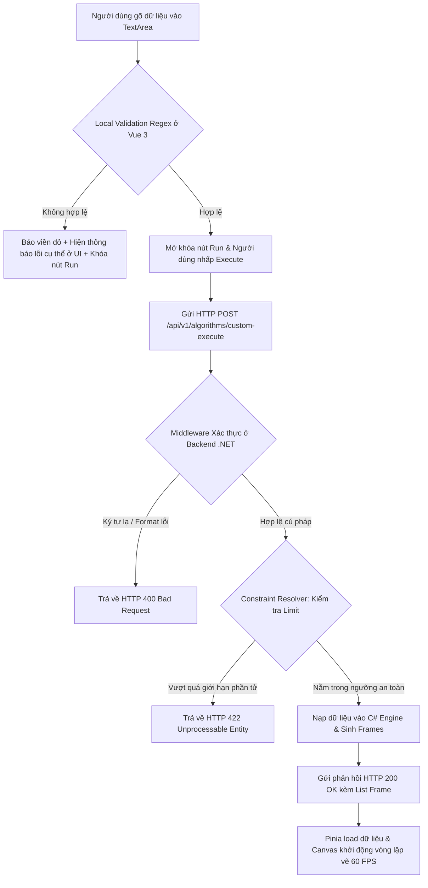

# 🚀 BỘ SINH DỮ LIỆU ĐẦU VÀO TÙY CHỈNH (CUSTOM INPUT GENERATOR)
## 📝 TÀI LIỆU KHẢO SÁT & THIẾT KẾ CHI TIẾT (PHASE 1)

Chào mừng bạn đến với tài liệu kỹ thuật chi tiết nhất về **Custom Input Generator** - cổng kết nối tương tác trực tiếp giữa người dùng và bộ máy giải thuật **VisualizationDSA**. Tài liệu này đặc tả chi tiết từ yêu cầu nghiệp vụ (PRD), thiết kế giao diện (UI/UX), quản lý trạng thái (Pinia), đến hệ thống xác thực an toàn đa lớp ở Backend (.NET Core) và các chiến lược bảo mật chống tấn công từ chối dịch vụ (DDoS).

---

## 📌 BẢN ĐỒ MỤC LỤC
1. [Mục tiêu Nghiệp vụ & Chân dung Người dùng (PRD)](#1-mục-tiêu-nghiệp-vụ--chân-dung-người-dùng-prd)
2. [Thiết kế Giao diện & Trải nghiệm tương tác (UI/UX Forms)](#2-thiết-kế-giao-diện--trải-nghiệm-tương-tác-uiux-forms)
3. [Kiến trúc Luồng dữ liệu & Xác thực Đa tầng (Data Flow & Validation)](#3-kiến-trúc-luồng-dữ-liệu--xác-thực-đa-tầng-data-flow--validation)
4. [Đặc tả Hệ thống Xác thực Phía Máy chủ (Backend C# Core Logic)](#4-đặc-tả-hệ-thống-xác-thực-phía-máy-chủ-backend-c-core-logic)
5. [Quản lý Trạng thái Nhập liệu (Frontend Pinia Store)](#5-quản-lý-trạng-thái-nhập-liệu-frontend-pinia-store)
6. [Đặc tả API Giao tiếp & Mã lỗi JSON Contract](#6-đặc-tả-api-giao-tiếp--mã-lỗi-json-contract)
7. [An ninh Hạ tầng & Phòng chống Tấn công Từ chối Dịch vụ (DDoS Shield)](#7-an-ninh-hạ-tầng--phòng-chống-tấn-công-từ-chối-dịch-vụ-ddos-shield)
8. [Kế hoạch triển khai & Kịch bản Kiểm thử E2E](#8-kế-hoạch-triển-khai--kịch-bản-kiểm-thử-e2e)

---

## 1. MỤC TIÊU NGHIỆP VỤ & CHÂN DUNG NGƯỜI DÙNG (PRD)

### 1.1. Tầm nhìn Tính năng
Nếu các bộ dữ liệu mặc định đóng gói sẵn làm nhiệm vụ giúp người dùng làm quen với thuật toán ở mức căn bản, thì tính năng **Custom Input** chính là chìa khóa mở ra không gian tự học và thực hành không giới hạn. Sinh viên có thể nhập chính xác các đề bài thực tế trên lớp, các góc cạnh dữ liệu đặc biệt (Edge Cases) để quan sát cách giải thuật xử lý, từ đó nâng cao sâu sắc tư duy thuật toán.

### 1.2. Chân dung Người dùng & Nhu cầu cụ thể
*   **Học viên ôn thi (Ví dụ: Minh, 20 tuổi):** Đang làm bài tập lớn về giải thuật đồ thị. Minh muốn tự vẽ một đồ thị có chu trình (cycle) hoặc nhập một danh sách cạnh cụ thể để xem giải thuật duyệt đồ thị (DFS/BFS) có bị lặp vô hạn hay không. Minh cần cơ chế nhập liệu dễ sử dụng và báo lỗi logic ngay lập tức nếu dữ liệu không hợp lệ.
*   **Người thích thử thách (Ví dụ: Vy, 21 tuổi):** Muốn thử nghiệm các trường hợp tệ nhất (Worst Cases) của thuật toán sắp xếp (ví dụ: mảng đảo ngược hoàn toàn đối với Quick Sort chọn pivot là phần tử cuối). Vy cần một bộ sinh mảng ngẫu nhiên thông minh, có thể tạo ra các mảng **Nearly Sorted** (Gần như đã sắp xếp) hoặc **Reversed** (Đảo ngược hoàn toàn) chỉ bằng 1 cú click chuột.

### 1.3. Phạm vi Nghiệp vụ (Scope of Phase 1)
*   **Trong phạm vi (In-Scope):**
    *   Nhập liệu mảng 1D (Array): Nhập qua chuỗi phân cách dấu phẩy (Comma-separated text), ví dụ: `15, 2, 88, -9, 4`.
    *   Sinh mảng ngẫu nhiên thông minh:
        *   *Random:* Ngẫu nhiên hoàn toàn.
        *   *Nearly Sorted:* Mảng đã được xếp tăng dần 90%, chỉ có 1-2 cặp phần tử bị đảo lộn (dùng để test Bubble Sort/Insertion Sort hiệu năng tối ưu).
        *   *Reversed:* Mảng đảo ngược hoàn toàn (dùng để test trường hợp tệ nhất của Bubble Sort).
    *   Xác thực đầu vào tức thì (Instant Local Regex Validation) ở Frontend.
    *   Hệ thống kiểm tra ranh giới an toàn (Guard Policy Resolver) ở Backend chống tràn bộ nhớ.
*   **Ngoài phạm vi (Out-of-Scope - Sẽ làm ở Phase 2):**
    *   Vẽ cấu trúc đồ thị (Graph Drawing Interactive Canvas) bằng kéo thả kéo node/edge.
    *   Đọc dữ liệu đầu vào trực tiếp từ tệp tin excel, csv lớn tải lên.

---

## 2. THIẾT KẾ GIAO DIỆN & TRẢI NGHIỆM TƯƠNG TÁC (UI/UX FORMS)

### 2.1. Cấu trúc Component Layout
Bảng nhập liệu được thiết kế dạng Tab mượt mà tích hợp bên trong khu vực điều khiển chính dưới Canvas:

```
+---------------------------------------------------------------+
|                       [Tab: Custom Input]                     |
+---------------------------------------------------------------+
| Nhập dữ liệu mảng (Cách nhau bằng dấu phẩy):                  |
| +-----------------------------------------------------------+ |
| | 12, 38, 25, 9, 4_                                         | | (Input TextArea)
| +-----------------------------------------------------------+ |
| [Đếm phần tử: 5 / 50]                        [Regex: Hợp lệ ✔] |
|                                                               |
|  [🎲 Sinh Ngẫu Nhiên ▼]      [Xóa Trắng]      [⚡ Thực Thi Chạy] |
|  +-------------------+                                        |
|  | - Ngẫu nhiên 100% |                                        | (Dropdown Chọn)
|  | - Gần như sắp xếp |                                        |
|  | - Đảo ngược 100%  |                                        |
|  +-------------------+                                        |
+---------------------------------------------------------------+
```

### 2.2. Trải nghiệm xử lý lỗi tức thì (Instant Visual Cues)
*   **Khi nhập đúng:** Khung TextArea có viền màu xanh Neon dịu, nhãn báo trạng thái `"Hợp lệ ✔"` hiển thị nhỏ bên dưới góc phải, nút **Execute** sáng rõ.
*   **Khi nhập sai (ví dụ: gõ chữ `a` hoặc nhập hai dấu phẩy liên tiếp `5,,3`):** Viền TextArea lập tức chuyển sang đỏ hồng cảnh báo, hiển thị thông điệp phụ đề đỏ: `"Lỗi: Chỉ cho phép nhập các số nguyên cách nhau bởi dấu phẩy."`, nút **Execute** bị vô hiệu hóa (disabled).
*   **Hiệu ứng chuyển cảnh (Loading Transitions):** Khi nhấn Execute, TextArea bị khóa (read-only), nút chuyển thành vòng xoay Shimmer Spinner, màn hình Canvas phủ một lớp mờ nhẹ (overlay) thể hiện tiến trình API đang tải dữ liệu hoạt ảnh mới.

---

## 3. KIẾN TRÚC LUỒNG DỮ LIỆU & XÁC THỰC ĐA TẦNG (DATA FLOW & VALIDATION)

Áp dụng nguyên lý bảo mật cao cấp **Zero Trust (Không tin tưởng bất kỳ ai)**. Hệ thống thiết lập hàng rào phòng thủ xác thực đa tầng nối tiếp từ Trình duyệt Client đến nhân xử lý lõi của Server.



---

## 4. ĐẶC TẢ HỆ THỐNG XÁC THỰC PHÍA MÁY CHỦ (BACKEND C# CORE LOGIC)

Backend không bao giờ tin tưởng dữ liệu được gửi từ phía Client để tránh trường hợp tin tặc vượt rào validation ở UI bằng các công cụ như Postman/Curl.

### 4.1. Bộ Phân tích & Trích xuất Dữ liệu (Backend String Parser)
Chúng ta xây dựng một Parser mạnh mẽ để bóc tách chuỗi thô thành mảng số nguyên, lọc bỏ khoảng trống dư thừa và phát hiện ký tự lạ:

```csharp
using System;
using System.Collections.Generic;
using System.Linq;
using System.Text.RegularExpressions;

namespace VisualizationDSA.Core.Input
{
    public static class InputParser
    {
        private static readonly Regex ArrayRegex = new(@"^([+-]?\d+)(\s*,\s*[+-]?\d+)*$");

        /// <summary>
        /// Phân tích cú pháp chuỗi đầu vào thô thành mảng số nguyên an toàn.
        /// </summary>
        public static int[] ParseArray(string rawInput)
        {
            if (string.IsNullOrWhiteSpace(rawInput))
            {
                throw new ArgumentException("Chuỗi dữ liệu đầu vào không được để trống.");
            }

            string cleanInput = rawInput.Trim();

            // Kiểm tra cấu trúc định dạng bằng Regex trước khi bóc tách
            if (!ArrayRegex.IsMatch(cleanInput))
            {
                throw new FormatException("Định dạng dữ liệu không hợp lệ. Chỉ cho phép các số nguyên cách nhau bằng dấu phẩy.");
            }

            try
            {
                return cleanInput
                    .Split(',', StringSplitOptions.RemoveEmptyEntries)
                    .Select(s => int.Parse(s.Trim()))
                    .ToArray();
            }
            catch (Exception)
            {
                throw new FormatException("Đã xảy ra lỗi trong quá trình phân tích số nguyên. Vui lòng kiểm tra lại giá trị nhập.");
            }
        }
    }
}
```

### 4.2. Bộ Điều phối Giới hạn thuật toán (Safety Constraints Resolver)
Để bảo vệ CPU, mỗi giải thuật sẽ được ánh xạ với một mức giới hạn (Safety Guard Limit) riêng biệt dựa trên độ phức tạp thuật toán:

```csharp
namespace VisualizationDSA.Core.Input
{
    public enum AlgorithmComplexity
    {
        Linear,          // O(N)
        LogLinear,       // O(N log N)
        Quadratic,       // O(N^2)
        Exponential      // O(2^N) hoặc O(N!)
    }

    public class ConstraintResolver
    {
        private static readonly Dictionary<string, int> SafetyLimits = new()
        {
            { "linear-search", 100 },
            { "binary-search", 150 },
            { "bubble-sort", 50 },
            { "selection-sort", 50 },
            { "quick-sort", 150 },
            { "merge-sort", 150 },
            { "tsp-backtracking", 10 } // Thuật toán nhánh cận cực nặng, giới hạn thấp
        };

        public static int GetMaxLimit(string algorithmId)
        {
            if (SafetyLimits.TryGetValue(algorithmId.ToLower(), out int limit))
            {
                return limit;
            }
            return 10; // Giới hạn an toàn mặc định cực thấp nếu không định nghĩa
        }

        public static bool ValidateSize(string algorithmId, int size, out int allowedLimit)
        {
            allowedLimit = GetMaxLimit(algorithmId);
            return size <= allowedLimit;
        }
    }
}
```

---

## 5. QUẢN LÝ TRẠNG THÁI NHẬP LIỆU (FRONTEND PINIA STORE)

Pinia chịu trách nhiệm quản lý vùng nhớ đệm nhập liệu tạm thời, gọi trình sinh mảng ngẫu nhiên và kiểm soát logic validate nhanh tại chỗ (client-side validation).

```typescript
import { defineStore } from 'pinia';
import { ref, computed } from 'vue';

export const useInputStore = defineStore('input', () => {
  // --- STATE ---
  const rawText = ref<string>('');
  const maxLimit = ref<number>(50); // Giới hạn mặc định sẽ cập nhật khi chọn thuật toán
  const isLoading = ref<boolean>(false);
  const apiErrorMessage = ref<string>('');

  // Regex kiểm tra chuỗi số cách nhau bởi dấu phẩy, hỗ trợ số âm và khoảng trắng tùy ý
  const arrayFormatRegex = /^([+-]?\d+)(\s*,\s*[+-]?\d+)*$/;

  // --- GETTERS (Tính toán trạng thái trực tiếp) ---
  
  // Trích xuất chuỗi thành mảng số nguyên tạm thời
  const parsedArray = computed<number[]>(() => {
    const cleanText = rawText.value.trim();
    if (!cleanText || !arrayFormatRegex.test(cleanText)) {
      return [];
    }
    return cleanText.split(',').map(s => parseInt(s.trim(), 10));
  });

  const elementCount = computed<number>(() => parsedArray.value.length);

  // Validate cú pháp tại chỗ
  const isValidFormat = computed<boolean>(() => {
    const cleanText = rawText.value.trim();
    if (cleanText === '') return true; // Cho phép trống tạm thời
    return arrayFormatRegex.test(cleanText);
  });

  // Validate kích thước giới hạn mảng số
  const isWithinLimit = computed<boolean>(() => {
    return elementCount.value <= maxLimit.value;
  });

  const canExecute = computed<boolean>(() => {
    return (
      rawText.value.trim() !== '' &&
      isValidFormat.value &&
      isWithinLimit.value &&
      elementCount.value > 0 &&
      !isLoading.value
    );
  });

  // --- ACTIONS ---
  
  /**
   * Thiết lập giới hạn kích thước an toàn tối đa cho thuật toán được chọn
   */
  function setLimit(limit: number) {
    maxLimit.value = limit;
  }

  /**
   * Bộ sinh mảng ngẫu nhiên thông minh tại Client
   */
  function generateRandomInput(type: 'random' | 'nearly-sorted' | 'reversed', size: number = 10) {
    const clampedSize = Math.min(size, maxLimit.value);
    let arr: number[] = [];

    // 1. Sinh mảng ngẫu nhiên cơ bản
    for (let i = 0; i < clampedSize; i++) {
      arr.push(Math.floor(Math.random() * 90) + 10); // Sinh số trong khoảng [10, 99] cho đẹp đồ họa
    }

    // 2. Tinh chỉnh mảng theo yêu cầu kiểm thử giải thuật đặc thù
    if (type === 'nearly-sorted') {
      arr.sort((a, b) => a - b);
      // Đổi chỗ ngẫu nhiên 1 cặp phần tử để tạo mảng "gần như đã sắp xếp"
      if (clampedSize > 3) {
        const idx1 = Math.floor(Math.random() * (clampedSize - 2));
        const idx2 = idx1 + 1;
        const temp = arr[idx1];
        arr[idx1] = arr[idx2];
        arr[idx2] = temp;
      }
    } else if (type === 'reversed') {
      arr.sort((a, b) => b - a); // Sắp xếp giảm dần hoàn toàn
    }

    rawText.value = arr.join(', ');
    apiErrorMessage.value = '';
  }

  function clear() {
    rawText.value = '';
    apiErrorMessage.value = '';
  }

  return {
    rawText,
    maxLimit,
    isLoading,
    apiErrorMessage,
    parsedArray,
    elementCount,
    isValidFormat,
    isWithinLimit,
    canExecute,
    setLimit,
    generateRandomInput,
    clear
  };
});
```

---

## 6. ĐẶC TẢ API GIAO TIẾP & MÃ LỖI JSON CONTRACT

*   **URL:** `/api/v1/algorithms/custom-execute`
*   **Method:** `POST`
*   **Content-Type:** `application/json`

### 6.1. JSON Gửi đi (Request Body)
```json
{
  "algorithmId": "bubble-sort",
  "rawInput": "24, 12, 85, 9, 3"
}
```

### 6.2. JSON Phản hồi khi xác thực lỗi định dạng ở Server (HTTP 400 Bad Request)
```json
{
  "status": 400,
  "title": "Bad Request",
  "errorType": "INVALID_FORMAT",
  "message": "Định dạng dữ liệu không hợp lệ. Chuỗi đầu vào chứa ký tự đặc biệt lạ hoặc sai cấu trúc phân tách."
}
```

### 6.3. JSON Phản hồi khi kích thước vượt giới hạn an toàn (HTTP 422 Unprocessable Entity)
```json
{
  "status": 422,
  "title": "Unprocessable Entity",
  "errorType": "SIZE_LIMIT_EXCEEDED",
  "message": "Kích thước mảng vượt quá giới hạn an toàn quy định của giải thuật bubble-sort O(N^2).",
  "details": {
    "maxAllowedLimit": 50,
    "currentInputSize": 85
  }
}
```

---

## 7. AN NINH HẠ TẦNG & PHÒNG CHỐNG DỌN DẸP TÀI NGUYÊN (DDOS SHIELD)

Do việc chạy giải thuật ở Backend tiêu tốn chu kỳ CPU, kẻ tấn công có thể lợi dụng viết script liên tục gửi mảng hợp lệ nhưng có cấu trúc phức tạp nhằm vắt kiệt năng lực xử lý của máy chủ. Chúng ta áp dụng 3 lá chắn bảo vệ:

### 7.1. Cấu hình Rate Limiting nghiêm ngặt trên API Custom
Áp dụng cơ chế lọc địa chỉ IP (IP Rate Limiting) riêng biệt cho Endpoint Custom. Giới hạn: **Tối đa 5 lượt sinh custom/phút trên mỗi IP**. Vượt hạn mức sẽ bị từ chối phục vụ ngay ở cổng Gateway với mã phản hồi `HTTP 429 Too Many Requests`.

### 7.2. Cơ chế Hủy tác vụ treo dòng (Thread Cancellation Timeout)
Trong trường hợp luồng thực thi giải thuật bị treo do lặp vô hạn ở Backend (ví dụ: lỗi trong giải thuật đồ thị tự chế của Phase 2), chúng ta áp dụng **`CancellationToken`** giới hạn thời gian chạy tối đa là **2 giây**:

```csharp
[HttpPost("custom-execute")]
public async Task<IActionResult> ExecuteCustom(
    [FromBody] CustomRequest request, 
    CancellationToken clientCancelToken)
{
    // Tạo nguồn cancel tự động sau 2 giây đề phòng thuật toán chạy quá lâu
    using var timeoutSrc = new CancellationTokenSource(TimeSpan.FromSeconds(2));
    using var linkedSrc = CancellationTokenSource.CreateLinkedTokenSource(
        timeoutSrc.Token, clientCancelToken);

    try
    {
        var result = await Task.Run(() => 
            _executor.Execute(request.Data, linkedSrc.Token), linkedSrc.Token);
            
        return Ok(result);
    }
    catch (OperationCanceledException)
    {
        return StatusCode(StatusCodes.Status504GatewayTimeout, new {
            message = "Yêu cầu xử lý thuật toán bị hủy bỏ do vượt quá thời gian thực thi an toàn (2 giây)."
        });
    }
}
```

---

## 8. KẾ HOẠCH TRIỂN KHAI & KỊCH BẢN KIỂM THỬ E2E

### 8.1. Lộ trình triển khai chia nhỏ
1.  **Bước 1: Thiết kế giao diện Form & Local Validation:** Hoàn tất TextArea, dropdown "Sinh Ngẫu Nhiên", viết Regex và đồng bộ nút bấm điều khiển ở Frontend.
2.  **Bước 2: Viết Parser & Constraint Resolver ở Backend:** Thiết lập bộ parse chuỗi thô thành mảng số nguyên, ánh xạ bảng giới hạn an toàn (Safety limits Dictionary) trên C# Web API.
3.  **Bước 3: Tích hợp API và Quản lý State Pinia:** Kết nối Pinia Store với API. Đảm bảo khi gửi thành công, Store Animation nhận dữ liệu và tiến hành vẽ lại Canvas tức thì.

### 8.2. Kịch bản kiểm thử E2E nghiêm ngặt (Playwright / Cypress)
*   **TC-01: Kiểm thử nhập sai cú pháp**
    *   *Hành động:* Gõ `12, a, 85` vào TextArea.
    *   *Kết quả mong muốn:* Viền TextArea chuyển đỏ, hiển thị câu báo lỗi, nút Execute tự động bị khóa (disabled).
*   **TC-02: Kiểm thử vượt quá giới hạn an toàn**
    *   *Hành động:* Chọn Bubble Sort (Limit 50), nhập chuỗi 55 số nguyên hợp lệ và bấm Execute qua Postman.
    *   *Kết quả mong muốn:* Backend trả về `HTTP 422 Unprocessable Entity` kèm mã lỗi cấu trúc `SIZE_LIMIT_EXCEEDED`.
*   **TC-03: Kiểm thử chức năng sinh mảng ngẫu nhiên thông minh**
    *   *Hành động:* Chọn giải thuật Bubble Sort, bấm "Sinh Ngẫu Nhiên" -> chọn "Đảo ngược 100%".
    *   *Kết quả mong muốn:* TextArea tự động điền một mảng gồm 10 số giảm dần hoàn chỉnh. Nút Run mở khóa. Bấm Run thì Canvas và timeline chạy chính xác tiến trình sắp xếp.
